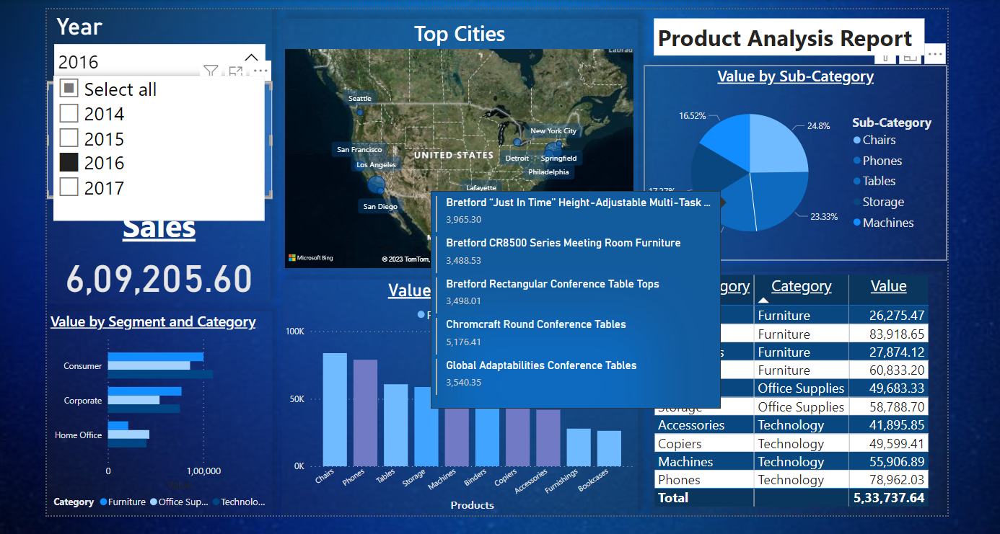

# SuperStore Product Analysis Report

#

# [CLick Here Dataset Link](https://drive.google.com/drive/folders/1ZcdycGs1EsQCEMe6kPxD8HRUffCD8GWo)

## Observations

- Total Sales over four years is 22,97,200.86 and profit is 2,86,397.02

- There is a up trend in profit from 2014-2017 and Profit in 2017 is 93,439.27

- Most sales is generated by consumers particularly in Technology

- Total quantity of products sold is 9994 and most sold product was Binders and Paper.

- In 2017 alone 3312 products were sold and Office Suplies Order by consumers are more than Coporate.

- Chicago, Seattle, LA, San Franciso and NewYork City ordered the most products

- Highest sales in 2017 was Phones but Most profit generated by Copiers

